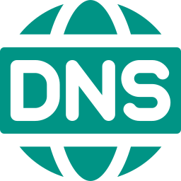

# Início

## Sobre a disciplina

Documentação reservada ao trabalho 1 "Camada de Aplicação: Cliente DNS" da disciplina de Fundamentos de Redes de Computadores (FRC) da Universidade de Brasília (UnB - FGA), lecionada pelo professor Tiago Alves. Este trabalho tem como objetivo estudar a implementação de esquemas de comunicações entre processos (IPC), especificamente a utilização da interface socket.

A disciplina de Fundamentos de Redes de Computadores trata de diversos tópicos relativos a Sistemas Operacionais, sistemas que provêem uma forma intuitiva de se utilizar as funcionalidades de computadores digitais sem que seja necessário ao usuário ou programador ter profundo
conhecimento das interações entre os diferentes hardwares que compõem um computador.

## Contribuidores

| **Foto** | **Nome** | **Matrícula** | **GitHub** |
| :------: | :------: | :-----------: | :--------: |
|  | João Victor Max Bisinotti de Oliveira | 170069991 | [joaobisi](https://github.com/joaobisi) |
|  | Lucas Lopes Rocha | 202023903 | [luclopesr](https://github.com/luclopesr) |

---

## Histórico de versão

| Versão |    Data    |            Descrição            |    Autor    |
| :----: | :--------: | :-----------------------------: | :---------: |
|  1.0   | 01/05/2024 | Criação e organização do início | Lucas Lopes |